**program:**

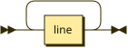

```
program  ::= line+
```

**line:**

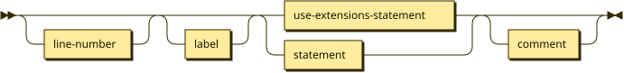

```
line     ::= line-number? label? ( use-extensions-statement | statement ) comment?
```

referenced by:

* program

**line-number:**

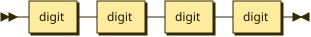

```
line-number
         ::= digit digit digit digit
```

referenced by:

* line

**statement:**

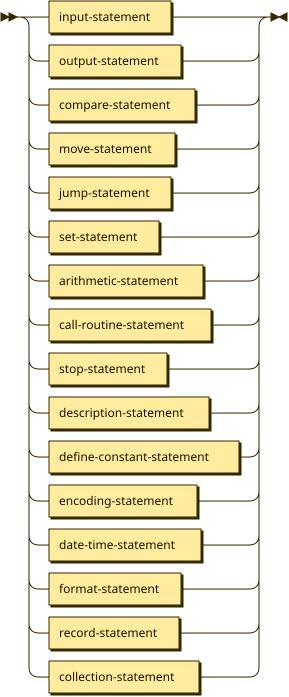

```
statement
         ::= input-statement
           | output-statement
           | compare-statement
           | move-statement
           | jump-statement
           | set-statement
           | arithmetic-statement
           | call-routine-statement
           | stop-statement
           | description-statement
           | define-constant-statement
           | encoding-statement
           | date-time-statement
           | format-statement
           | record-statement
           | collection-statement
```

referenced by:

* line

**input-statement:**

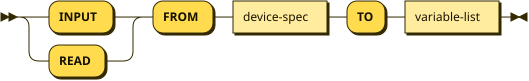

```
input-statement
         ::= ( 'INPUT' | 'READ' ) 'FROM' device-spec 'TO' variable-list
```

referenced by:

* statement

**output-statement:**

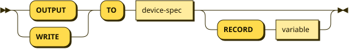

```
output-statement
         ::= ( 'OUTPUT' | 'WRITE' ) 'TO' device-spec ( 'RECORD' variable )?
```

referenced by:

* statement

**compare-statement:**

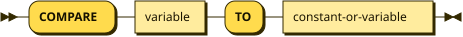

```
compare-statement
         ::= 'COMPARE' variable 'TO' constant-or-variable
```

referenced by:

* statement

**move-statement:**

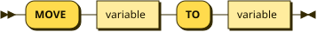

```
move-statement
         ::= 'MOVE' variable 'TO' variable
```

referenced by:

* statement

**set-statement:**

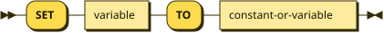

```
set-statement
         ::= 'SET' variable 'TO' constant-or-variable
```

referenced by:

* statement

**arithmetic-statement:**

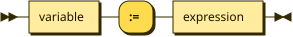

```
arithmetic-statement
         ::= variable ':=' expression
```

referenced by:

* statement

**jump-statement:**

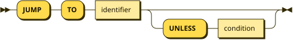

```
jump-statement
         ::= 'JUMP' 'TO' identifier ( 'UNLESS' condition )?
```

referenced by:

* statement

**condition:**

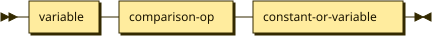

```
condition
         ::= variable comparison-op constant-or-variable
```

referenced by:

* jump-statement

**comparison-op:**

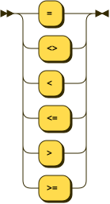

```
comparison-op
         ::= '='
           | '<>'
           | '<'
           | '<='
           | '>'
           | '>='
```

referenced by:

* condition

**description-statement:**

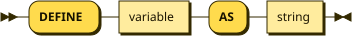

```
description-statement
         ::= 'DEFINE' variable 'AS' string
```

referenced by:

* statement

**define-constant-statement:**

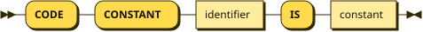

```
define-constant-statement
         ::= 'CODE' 'CONSTANT' identifier 'IS' constant
```

referenced by:

* statement

**constant:**

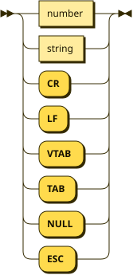

```
constant ::= number
           | string
           | 'CR'
           | 'LF'
           | 'VTAB'
           | 'TAB'
           | 'NULL'
           | 'ESC'
```

referenced by:

* constant-or-variable
* define-constant-statement
* factor

**variable-list:**

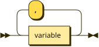

```
variable-list
         ::= variable ( ',' variable )*
```

referenced by:

* input-statement

**variable:**

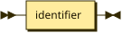

```
variable ::= identifier
```

referenced by:

* arithmetic-statement
* collection-statement
* compare-statement
* condition
* constant-or-variable
* date-time-statement
* description-statement
* factor
* format-statement
* move-statement
* output-statement
* set-statement
* variable-list

**constant-or-variable:**

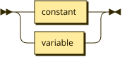

```
constant-or-variable
         ::= constant
           | variable
```

referenced by:

* collection-statement
* compare-statement
* condition
* set-statement

**expression:**

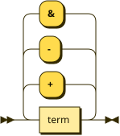

```
expression
         ::= term ( ( '+' | '-' | '&' ) term )*
```

referenced by:

* arithmetic-statement
* factor

**term:**

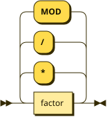

```
term     ::= factor ( ( '*' | '/' | 'MOD' ) factor )*
```

referenced by:

* expression

**factor:**

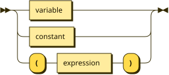

```
factor   ::= variable
           | constant
           | '(' expression ')'
```

referenced by:

* term

**identifier:**

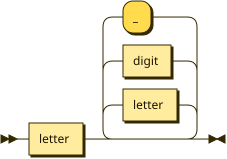

```
identifier
         ::= letter ( letter | digit | '_' )*
```

referenced by:

* collection-statement
* define-constant-statement
* field-definition
* jump-statement
* record-statement
* variable

**number:**

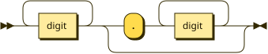

```
number   ::= digit+ ( '.' digit+ )?
```

referenced by:

* collection-statement
* console-param
* constant
* supplemental-spec

**string:**

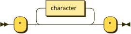

```
string   ::= '"' character* '"'
```

referenced by:

* constant
* currency-spec
* description-statement
* format-spec
* number-spec
* supplemental-spec

**comment:**

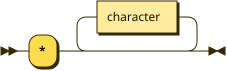

```
comment  ::= '*' character*
```

referenced by:

* line

**digit:**

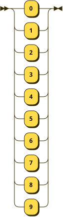

```
digit    ::= '0'
           | '1'
           | '2'
           | '3'
           | '4'
           | '5'
           | '6'
           | '7'
           | '8'
           | '9'
```

referenced by:

* identifier
* line-number
* number

**letter:**

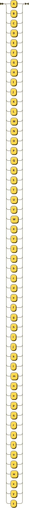

```
letter   ::= 'A'
           | 'B'
           | 'C'
           | 'D'
           | 'E'
           | 'F'
           | 'G'
           | 'H'
           | 'I'
           | 'J'
           | 'K'
           | 'L'
           | 'M'
           | 'N'
           | 'O'
           | 'P'
           | 'Q'
           | 'R'
           | 'S'
           | 'T'
           | 'U'
           | 'V'
           | 'W'
           | 'X'
           | 'Y'
           | 'Z'
           | 'a'
           | 'b'
           | 'c'
           | 'd'
           | 'e'
           | 'f'
           | 'g'
           | 'h'
           | 'i'
           | 'j'
           | 'k'
           | 'l'
           | 'm'
           | 'n'
           | 'o'
           | 'p'
           | 'q'
           | 'r'
           | 's'
           | 't'
           | 'u'
           | 'v'
           | 'w'
           | 'x'
           | 'y'
           | 'z'
```

referenced by:

* identifier

**character:**

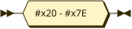

```
character
         ::= #x20 - #x7E
```

referenced by:

* comment
* string

**use-extensions-statement:**

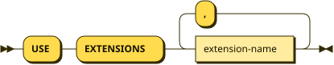

```
use-extensions-statement
         ::= 'USE' 'EXTENSIONS' extension-name ( ',' extension-name )*
```

referenced by:

* line

**extension-name:**

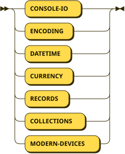

```
extension-name
         ::= 'CONSOLE-IO'
           | 'ENCODING'
           | 'DATETIME'
           | 'CURRENCY'
           | 'RECORDS'
           | 'COLLECTIONS'
           | 'MODERN-DEVICES'
```

referenced by:

* use-extensions-statement

**encoding-statement:**

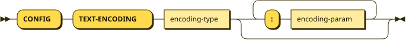

```
encoding-statement
         ::= 'CONFIG' 'TEXT-ENCODING' encoding-type ( ':' encoding-param )*
```

referenced by:

* statement

**encoding-type:**

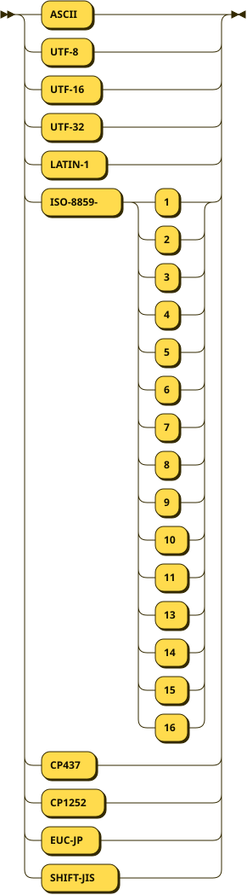

```
encoding-type
         ::= 'ASCII'
           | 'UTF-8'
           | 'UTF-16'
           | 'UTF-32'
           | 'LATIN-1'
           | 'ISO-8859-' ( '1' | '2' | '3' | '4' | '5' | '6' | '7' | '8' | '9' | '10'
                  | '11' | '13' | '14' | '15' | '16' )
           | 'CP437'
           | 'CP1252'
           | 'EUC-JP'
           | 'SHIFT-JIS'
```

referenced by:

* encoding-statement

**encoding-param:**

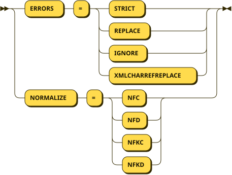

```
encoding-param
         ::= 'ERRORS' '=' ( 'STRICT' | 'REPLACE' | 'IGNORE' | 'XMLCHARREFREPLACE'
                  )
           | 'NORMALIZE' '=' ( 'NFC' | 'NFD' | 'NFKC' | 'NFKD' )
```

referenced by:

* encoding-statement

**console-spec:**

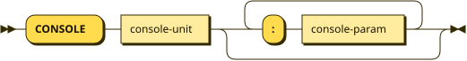

```
console-spec
         ::= 'CONSOLE' console-unit ( ':' console-param )*
```

**console-unit:**

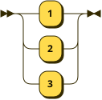

```
console-unit
         ::= '1'
           | '2'
           | '3'
```

referenced by:

* console-spec

**console-param:**

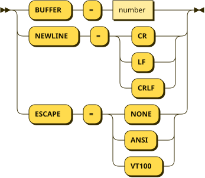

```
console-param
         ::= 'BUFFER' '=' number
           | 'NEWLINE' '=' ( 'CR' | 'LF' | 'CRLF' )
           | 'ESCAPE' '=' ( 'NONE' | 'ANSI' | 'VT100' )
```

referenced by:

* console-spec

**date-time-statement:**

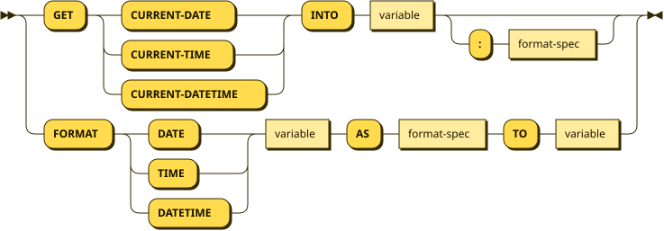

```
date-time-statement
         ::= 'GET' ( 'CURRENT-DATE' | 'CURRENT-TIME' | 'CURRENT-DATETIME' ) 'INTO'
                  variable ( ':' format-spec )?
           | 'FORMAT' ( 'DATE' | 'TIME' | 'DATETIME' ) variable 'AS' format-spec 'TO' variable
```

referenced by:

* statement

**format-spec:**

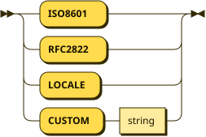

```
format-spec
         ::= 'ISO8601'
           | 'RFC2822'
           | 'LOCALE'
           | 'CUSTOM' string
```

referenced by:

* date-time-statement

**format-statement:**

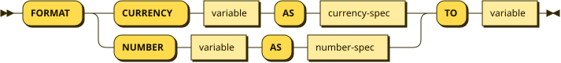

```
format-statement
         ::= 'FORMAT' ( 'CURRENCY' variable 'AS' currency-spec | 'NUMBER' variable 'AS' number-spec ) 'TO' variable
```

referenced by:

* statement

**currency-spec:**

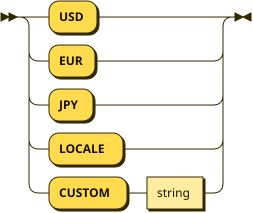

```
currency-spec
         ::= 'USD'
           | 'EUR'
           | 'JPY'
           | 'LOCALE'
           | 'CUSTOM' string
```

referenced by:

* format-statement

**number-spec:**

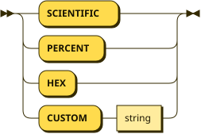

```
number-spec
         ::= 'SCIENTIFIC'
           | 'PERCENT'
           | 'HEX'
           | 'CUSTOM' string
```

referenced by:

* format-statement

**record-statement:**

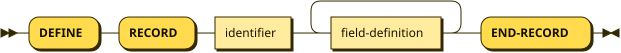

```
record-statement
         ::= 'DEFINE' 'RECORD' identifier field-definition+ 'END-RECORD'
```

referenced by:

* statement

**field-definition:**

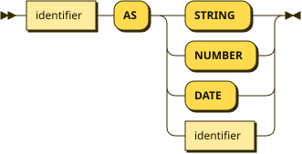

```
field-definition
         ::= identifier 'AS' ( 'STRING' | 'NUMBER' | 'DATE' | identifier )
```

referenced by:

* record-statement

**collection-statement:**

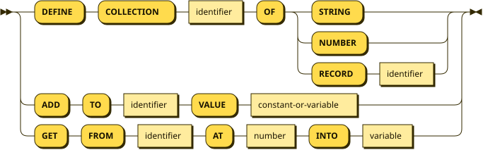

```
collection-statement
         ::= 'DEFINE' 'COLLECTION' identifier 'OF' ( 'STRING' | 'NUMBER' | 'RECORD' identifier )
           | 'ADD' 'TO' identifier 'VALUE' constant-or-variable
           | 'GET' 'FROM' identifier 'AT' number 'INTO' variable
```

referenced by:

* statement

**modern-device-spec:**

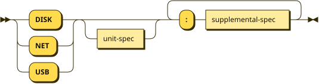

```
modern-device-spec
         ::= ( 'DISK' | 'NET' | 'USB' ) unit-spec? ( ':' supplemental-spec )+
```

**supplemental-spec:**

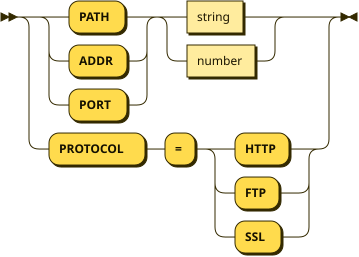

```
supplemental-spec
         ::= ( 'PATH' | 'ADDR' | 'PORT' ) ( string | number )
           | 'PROTOCOL' '=' ( 'HTTP' | 'FTP' | 'SSL' )
```

referenced by:

* modern-device-spec

## 
 <sup>generated by [RR - Railroad Diagram Generator][RR]</sup>

[RR]: https://www.bottlecaps.de/rr/ui